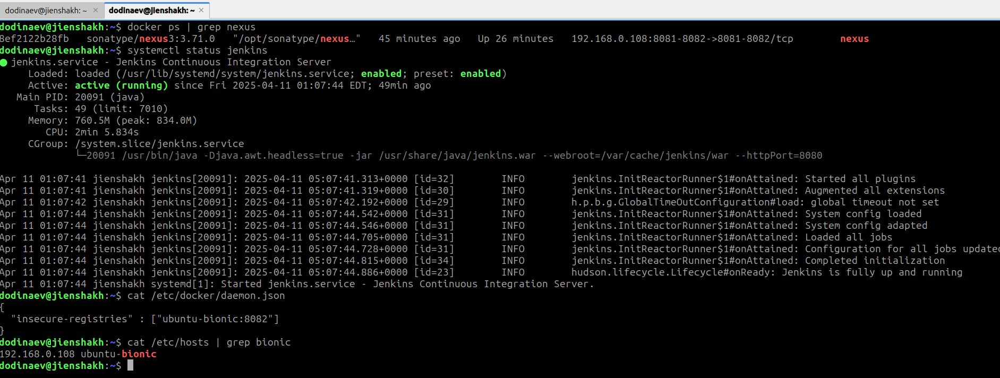
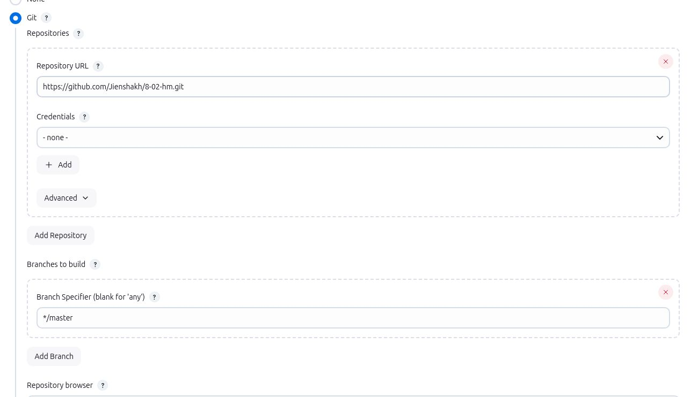
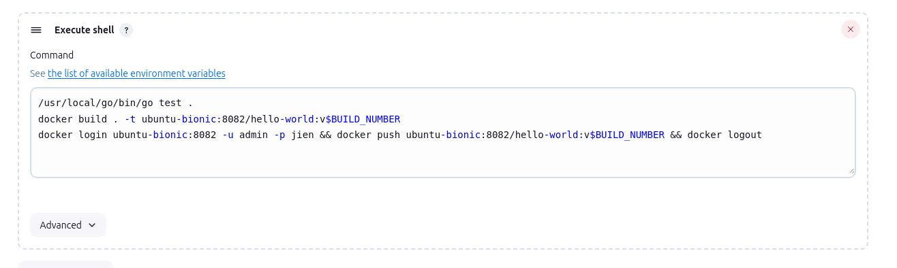
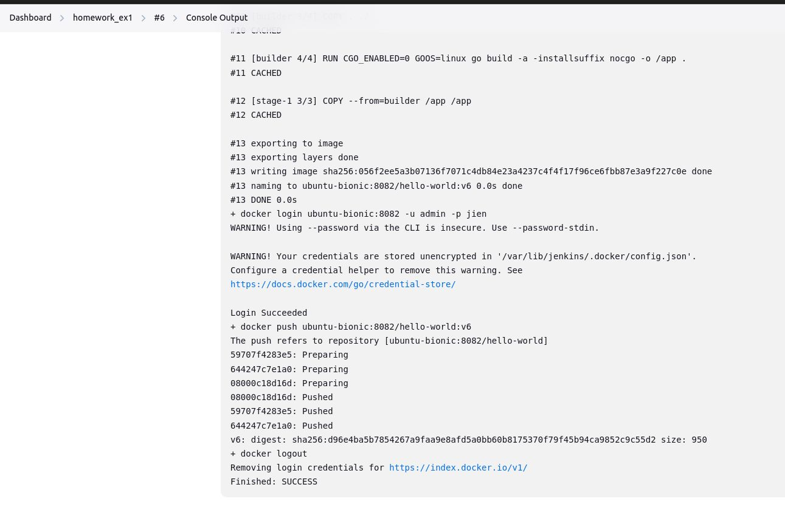
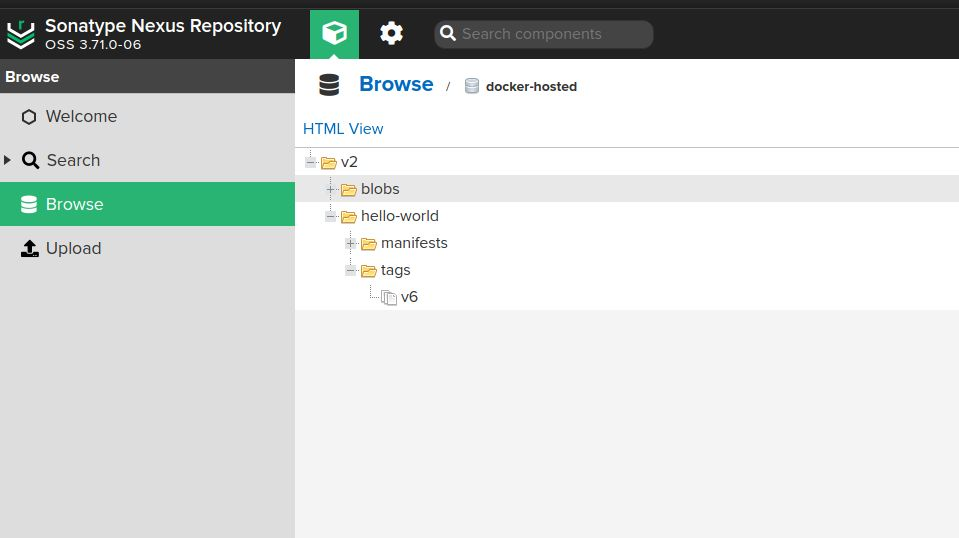
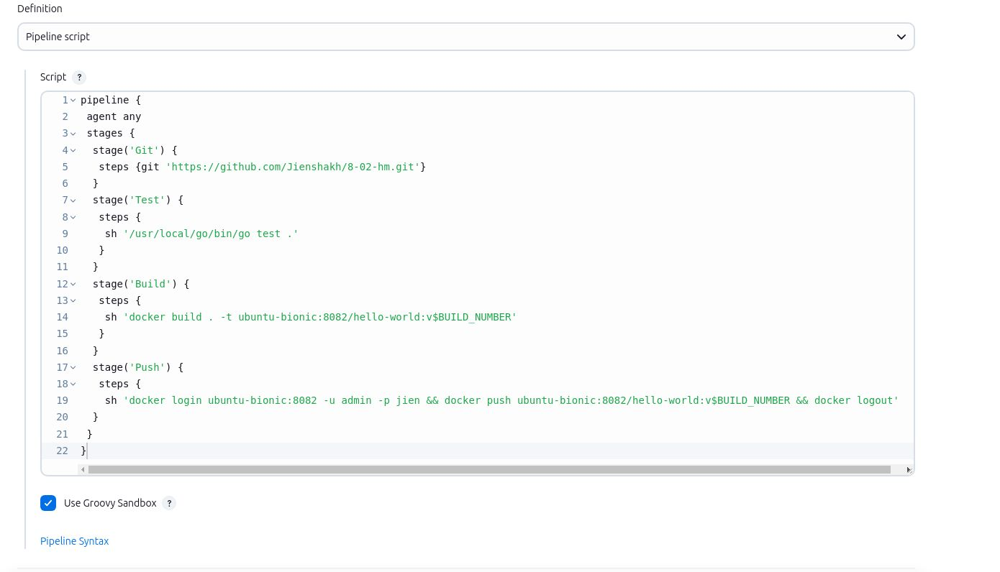
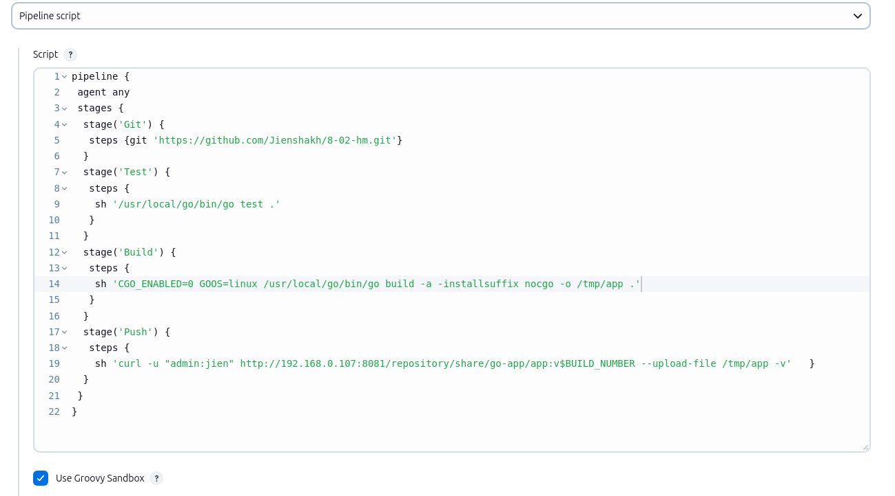
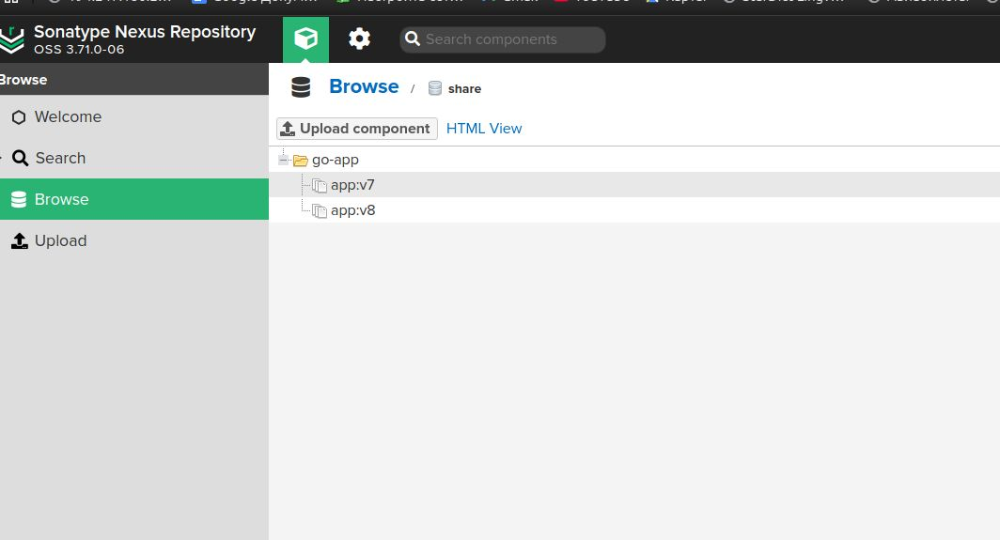

# Домашнее задание к занятию "`Что такое DevOps. СI/СD`" - `Одинаев Джиеншах`


### Инструкция по выполнению домашнего задания

   1. Сделайте `fork` данного репозитория к себе в Github и переименуйте его по названию или номеру занятия, например, https://github.com/имя-вашего-репозитория/git-hw или  https://github.com/имя-вашего-репозитория/7-1-ansible-hw).
   2. Выполните клонирование данного репозитория к себе на ПК с помощью команды `git clone`.
   3. Выполните домашнее задание и заполните у себя локально этот файл README.md:
      - впишите вверху название занятия и вашу фамилию и имя
      - в каждом задании добавьте решение в требуемом виде (текст/код/скриншоты/ссылка)
      - для корректного добавления скриншотов воспользуйтесь [инструкцией "Как вставить скриншот в шаблон с решением](https://github.com/netology-code/sys-pattern-homework/blob/main/screen-instruction.md)
      - при оформлении используйте возможности языка разметки md (коротко об этом можно посмотреть в [инструкции  по MarkDown](https://github.com/netology-code/sys-pattern-homework/blob/main/md-instruction.md))
   4. После завершения работы над домашним заданием сделайте коммит (`git commit -m "comment"`) и отправьте его на Github (`git push origin`);
   5. Для проверки домашнего задания преподавателем в личном кабинете прикрепите и отправьте ссылку на решение в виде md-файла в вашем Github.
   6. Любые вопросы по выполнению заданий спрашивайте в чате учебной группы и/или в разделе “Вопросы по заданию” в личном кабинете.
   
Желаем успехов в выполнении домашнего задания!
   
### Дополнительные материалы, которые могут быть полезны для выполнения задания

1. [Руководство по оформлению Markdown файлов](https://gist.github.com/Jekins/2bf2d0638163f1294637#Code)

---

### Задание 1

**Скрин терминала**

**Скрин 1. настройки в UI Jenkins**

**Скрин 2. настройки в UI Jenkins**

**Скрин логов pipeline**

**Скрин артефакта в Nexus**


---

### Задание 2

**Скрин. настройки в UI Jenkins**


**Логи pipeline**
```
Started by user jienshakh

[Pipeline] Start of Pipeline
[Pipeline] node
Running on Jenkins
 in /var/lib/jenkins/workspace/homework_ex2
[Pipeline] {
[Pipeline] stage
[Pipeline] { (Git)
[Pipeline] git
The recommended git tool is: NONE
No credentials specified
 > git rev-parse --resolve-git-dir /var/lib/jenkins/workspace/homework_ex2/.git # timeout=10
Fetching changes from the remote Git repository
 > git config remote.origin.url https://github.com/Jienshakh/8-02-hm.git # timeout=10
Fetching upstream changes from https://github.com/Jienshakh/8-02-hm.git
 > git --version # timeout=10
 > git --version # 'git version 2.43.0'
 > git fetch --tags --force --progress -- https://github.com/Jienshakh/8-02-hm.git +refs/heads/*:refs/remotes/origin/* # timeout=10
 > git rev-parse refs/remotes/origin/master^{commit} # timeout=10
Checking out Revision da5acf7bcb7f437637adf06fbd03a24dc2c8f13e (refs/remotes/origin/master)
 > git config core.sparsecheckout # timeout=10
 > git checkout -f da5acf7bcb7f437637adf06fbd03a24dc2c8f13e # timeout=10
 > git branch -a -v --no-abbrev # timeout=10
 > git branch -D master # timeout=10
 > git checkout -b master da5acf7bcb7f437637adf06fbd03a24dc2c8f13e # timeout=10
Commit message: "branch main, add creds for vagrant box"
 > git rev-list --no-walk da5acf7bcb7f437637adf06fbd03a24dc2c8f13e # timeout=10
[Pipeline] }
[Pipeline] // stage
[Pipeline] stage
[Pipeline] { (Test)
[Pipeline] sh
+ /usr/local/go/bin/go test .
ok  	github.com/netology-code/sdvps-materials	(cached)
[Pipeline] }
[Pipeline] // stage
[Pipeline] stage
[Pipeline] { (Build)
[Pipeline] sh
+ docker build . -t ubuntu-bionic:8082/hello-world:v7
#0 building with "default" instance using docker driver

#1 [internal] load build definition from Dockerfile
#1 transferring dockerfile: 350B 0.0s done
#1 DONE 0.0s

#2 [internal] load metadata for docker.io/library/alpine:latest
#2 DONE 1.6s

#3 [internal] load metadata for docker.io/library/golang:1.16
#3 DONE 1.6s

#4 [internal] load .dockerignore
#4 transferring context: 2B done
#4 DONE 0.0s

#5 [stage-1 1/3] FROM docker.io/library/alpine:latest@sha256:a8560b36e8b8210634f77d9f7f9efd7ffa463e380b75e2e74aff4511df3ef88c
#5 DONE 0.0s

#6 [builder 1/4] FROM docker.io/library/golang:1.16@sha256:5f6a4662de3efc6d6bb812d02e9de3d8698eea16b8eb7281f03e6f3e8383018e
#6 DONE 0.0s

#7 [internal] load build context
#7 transferring context: 16.24kB 0.1s done
#7 DONE 0.2s

#8 [builder 2/4] WORKDIR /go/src/github.com/netology-code/sdvps-materials
#8 CACHED

#9 [builder 3/4] COPY . ./
#9 DONE 0.2s

#10 [builder 4/4] RUN CGO_ENABLED=0 GOOS=linux go build -a -installsuffix nocgo -o /app .
#10 DONE 10.4s

#11 [stage-1 2/3] RUN apk -U add ca-certificates
#11 CACHED

#12 [stage-1 3/3] COPY --from=builder /app /app
#12 CACHED

#13 exporting to image
#13 exporting layers done
#13 writing image sha256:056f2ee5a3b07136f7071c4db84e23a4237c4f4f17f96ce6fbb87e3a9f227c0e done
#13 naming to ubuntu-bionic:8082/hello-world:v7 done
#13 DONE 0.0s
[Pipeline] }
[Pipeline] // stage
[Pipeline] stage
[Pipeline] { (Push)
[Pipeline] sh
+ docker login ubuntu-bionic:8082 -u admin -p jien
WARNING! Using --password via the CLI is insecure. Use --password-stdin.
Login Succeeded
+ docker push ubuntu-bionic:8082/hello-world:v7
The push refers to repository [ubuntu-bionic:8082/hello-world]
59707f4283e5: Preparing
644247c7e1a0: Preparing
08000c18d16d: Preparing
08000c18d16d: Layer already exists
644247c7e1a0: Layer already exists
59707f4283e5: Layer already exists
v7: digest: sha256:d96e4ba5b7854267a9faa9e8afd5a0bb60b8175370f79f45b94ca9852c9c55d2 size: 950
+ docker logout
Removing login credentials for https://index.docker.io/v1/
[Pipeline] }
[Pipeline] // stage
[Pipeline] }
[Pipeline] // node
[Pipeline] End of Pipeline
Finished: SUCCESS
```
---

### Задание 3


**Скрин. настройки в UI Jenkins**


**Логи pipeline**
```
Started by user jienshakh
[Pipeline] Start of Pipeline
[Pipeline] node
Running on Jenkins in /var/lib/jenkins/workspace/homework_ex3
[Pipeline] {
[Pipeline] stage
[Pipeline] { (Git)
[Pipeline] git
The recommended git tool is: NONE
No credentials specified
Cloning the remote Git repository
Cloning repository https://github.com/Jienshakh/8-02-hm.git
 > git init /var/lib/jenkins/workspace/homework_ex3 # timeout=10
Fetching upstream changes from https://github.com/Jienshakh/8-02-hm.git
 > git --version # timeout=10
 > git --version # 'git version 2.43.0'
 > git fetch --tags --force --progress -- https://github.com/Jienshakh/8-02-hm.git +refs/heads/*:refs/remotes/origin/* # timeout=10
 > git config remote.origin.url https://github.com/Jienshakh/8-02-hm.git # timeout=10
 > git config --add remote.origin.fetch +refs/heads/*:refs/remotes/origin/* # timeout=10
Avoid second fetch
 > git rev-parse refs/remotes/origin/master^{commit} # timeout=10
Checking out Revision da5acf7bcb7f437637adf06fbd03a24dc2c8f13e (refs/remotes/origin/master)
 > git config core.sparsecheckout # timeout=10
 > git checkout -f da5acf7bcb7f437637adf06fbd03a24dc2c8f13e # timeout=10
 > git branch -a -v --no-abbrev # timeout=10
 > git checkout -b master da5acf7bcb7f437637adf06fbd03a24dc2c8f13e # timeout=10
Commit message: "branch main, add creds for vagrant box"
 > git rev-list --no-walk da5acf7bcb7f437637adf06fbd03a24dc2c8f13e # timeout=10
[Pipeline] }
[Pipeline] // stage
[Pipeline] stage
[Pipeline] { (Test)
[Pipeline] sh
+ /usr/local/go/bin/go test .
ok  	github.com/netology-code/sdvps-materials	0.004s
[Pipeline] }
[Pipeline] // stage
[Pipeline] stage
[Pipeline] { (Build)
[Pipeline] sh
+ CGO_ENABLED=0 GOOS=linux /usr/local/go/bin/go build -a -installsuffix nocgo -o /tmp/app .
[Pipeline] }
[Pipeline] // stage
[Pipeline] stage
[Pipeline] { (Push)
[Pipeline] sh
+ curl -u admin:jien http://192.168.0.107:8081/repository/share/go-app/app:v8 --upload-file /tmp/app -v
  % Total    % Received % Xferd  Average Speed   Time    Time     Time  Current
                                 Dload  Upload   Total   Spent    Left  Speed

  0     0    0     0    0     0      0      0 --:--:-- --:--:-- --:--:--     0*   Trying 192.168.0.107:8081...
* Connected to 192.168.0.107 (192.168.0.107) port 8081
* Server auth using Basic with user 'admin'
> PUT /repository/share/go-app/app:v8 HTTP/1.1
> Host: 192.168.0.107:8081
> Authorization: Basic YWRtaW46amllbg==
> User-Agent: curl/8.5.0
> Accept: */*
> Content-Length: 2321352
> Expect: 100-continue
> 
< HTTP/1.1 100 Continue
} [65536 bytes data]
* We are completely uploaded and fine
< HTTP/1.1 201 Created
< Date: Sat, 12 Apr 2025 14:00:43 GMT
< Server: Nexus/3.71.0-06 (OSS)
< X-Content-Type-Options: nosniff
< Content-Security-Policy: sandbox allow-forms allow-modals allow-popups allow-presentation allow-scripts allow-top-navigation
< X-XSS-Protection: 1; mode=block
< Content-Length: 0
< 

100 2266k    0     0  100 2266k      0  10.1M --:--:-- --:--:-- --:--:-- 10.2M
* Connection #0 to host 192.168.0.107 left intact
[Pipeline] }
[Pipeline] // stage
[Pipeline] }
[Pipeline] // node
[Pipeline] End of Pipeline
Finished: SUCCESS
```
**Скрин артефакта в Nexus**
