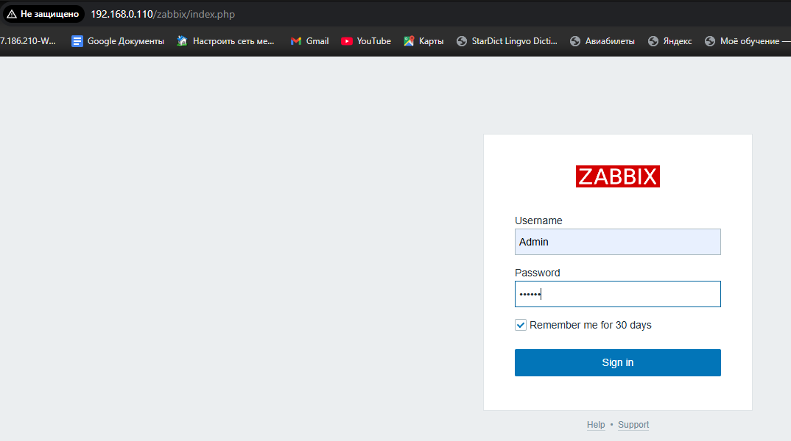
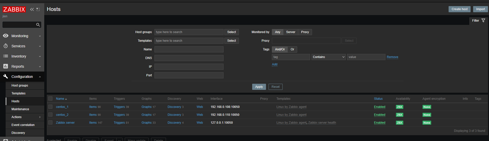
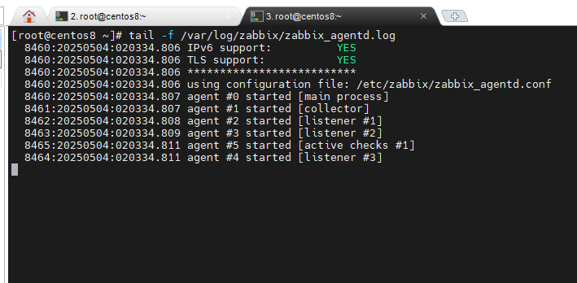
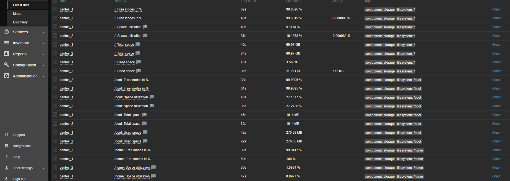

# Домашнее задание к занятию "`Система мониторинга Zabbix`" - `Одинаев Джиеншах`


### Инструкция по выполнению домашнего задания

   1. Сделайте `fork` данного репозитория к себе в Github и переименуйте его по названию или номеру занятия, например, https://github.com/имя-вашего-репозитория/git-hw или  https://github.com/имя-вашего-репозитория/7-1-ansible-hw).
   2. Выполните клонирование данного репозитория к себе на ПК с помощью команды `git clone`.
   3. Выполните домашнее задание и заполните у себя локально этот файл README.md:
      - впишите вверху название занятия и вашу фамилию и имя
      - в каждом задании добавьте решение в требуемом виде (текст/код/скриншоты/ссылка)
      - для корректного добавления скриншотов воспользуйтесь [инструкцией "Как вставить скриншот в шаблон с решением](https://github.com/netology-code/sys-pattern-homework/blob/main/screen-instruction.md)
      - при оформлении используйте возможности языка разметки md (коротко об этом можно посмотреть в [инструкции  по MarkDown](https://github.com/netology-code/sys-pattern-homework/blob/main/md-instruction.md))
   4. После завершения работы над домашним заданием сделайте коммит (`git commit -m "comment"`) и отправьте его на Github (`git push origin`);
   5. Для проверки домашнего задания преподавателем в личном кабинете прикрепите и отправьте ссылку на решение в виде md-файла в вашем Github.
   6. Любые вопросы по выполнению заданий спрашивайте в чате учебной группы и/или в разделе “Вопросы по заданию” в личном кабинете.
   
Желаем успехов в выполнении домашнего задания!
   
### Дополнительные материалы, которые могут быть полезны для выполнения задания

1. [Руководство по оформлению Markdown файлов](https://gist.github.com/Jekins/2bf2d0638163f1294637#Code)

---

### Задание 1


1. Прикрепите в файл README.md скриншот авторизации в админке

`

2. Приложите в файл README.md текст использованных команд в GitHub.

```
sudo dnf module disable postgresql:10
sudo dnf module enable postgresql:13
dnf install postgresql
dnf install postgresql-server
postgresql-setup --initdb
systemctl start postgresql
systemctl enable postgresql
rpm -Uvh https://repo.zabbix.com/zabbix/6.0/rhel/8/x86_64/zabbix-release-latest-6.0.el8.noarch.rpm
dnf clean all
dnf install zabbix-server-pgsql zabbix-web-pgsql zabbix-apache-conf zabbix-sql-scripts zabbix-selinux-policy
su - postgres -c 'psql --command "CREATE USER zabbix WITH PASSWORD '\'123456789\'';"'
su - postgres -c 'psql --command "CREATE DATABASE zabbix OWNER zabbix;"
zcat /usr/share/zabbix-sql-scripts/postgresql/server.sql.gz | sudo -u zabbix psql zabbix
sed -i 's/# DBPassword=/DBPassword=123456789/g' /etc/zabbix/zabbix_server.conf
systemctl restart zabbix-server httpd php-fpm
systemctl status zabbix-server
firewall-cmd --permanent --add-service=http
firewall-cmd --reload
firewall-cmd --permanent --add-port=5432/tcp
firewall-cmd --reload
sed -i 's/# listen_addresses = 'localhost'/listen_addresses = '*'/g' /var/lib/pgsql/data/postgresql.conf
```

В файл `/var/lib/pgsql/data/pg_hba.conf` внес изменения. 
Было:

```
# IPv4 local connections:
host    all             all             127.0.0.1/32            ident
# IPv6 local connections:
host    all             all             ::1/128                 ident

```

Стало:

```
# IPv4 local connections:
host    all             all             127.0.0.1/32            md5
host    all             all             192.168.0.0/24          md5
# IPv6 local connections:
host    all             all             ::1/128                 md5
```

---

### Задание 2

1. Приложите в файл README.md скриншот раздела Configuration > Hosts, где видно, что агенты подключены к серверу
`
2. Приложите в файл README.md скриншот лога zabbix agent, где видно, что он работает с сервером
`
3. Приложите в файл README.md скриншот раздела Monitoring > Latest data для обоих хостов, где видны поступающие от агентов данные.
`
4. Приложите в файл README.md текст использованных команд в GitHub

```
rpm -Uvh https://repo.zabbix.com/zabbix/6.0/rhel/8/x86_64/zabbix-release-latest-6.0.el8.noarch.rpm
dnf clean all
dnf install zabbix-agent
systemctl restart zabbix-agent
systemctl enable zabbix-agent
sed -i 's/Server=127.0.0.1/Server=192.168.0.110/g' /etc/zabbix/zabbix-agentd.conf
firewall-cmd --permanent --add-port=10050/tcp
firewall-cmd --reload
systemctl restart zabbix-agent
```

---

