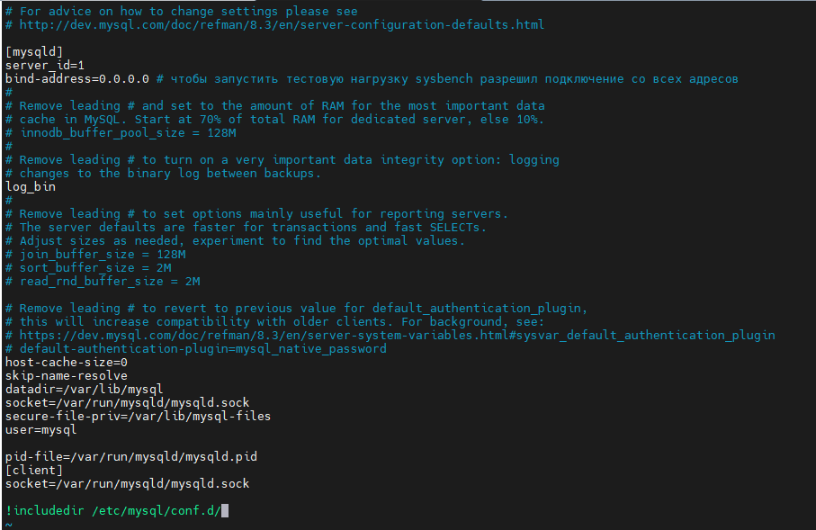
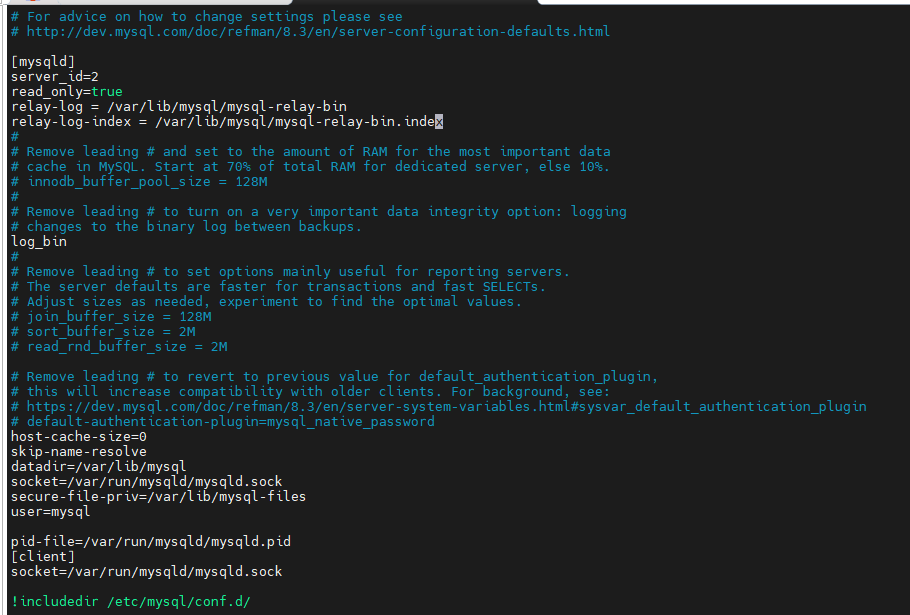
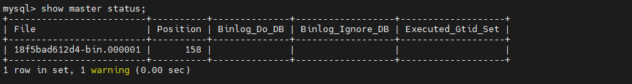
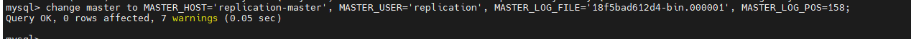
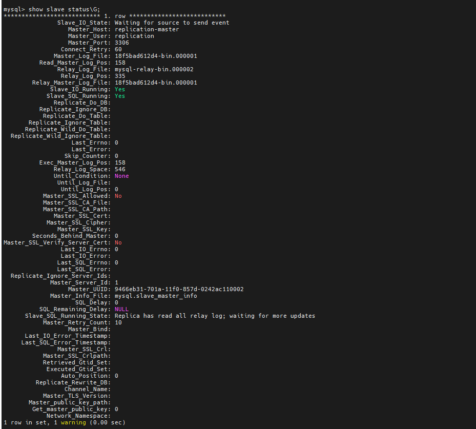
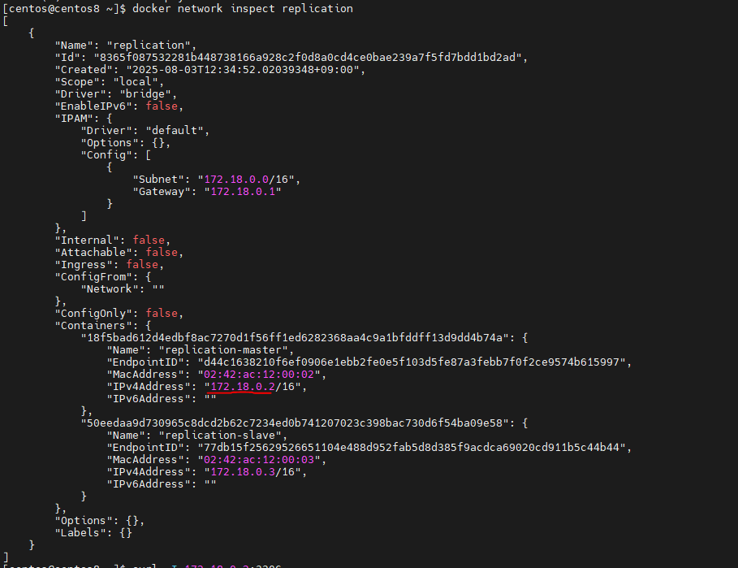
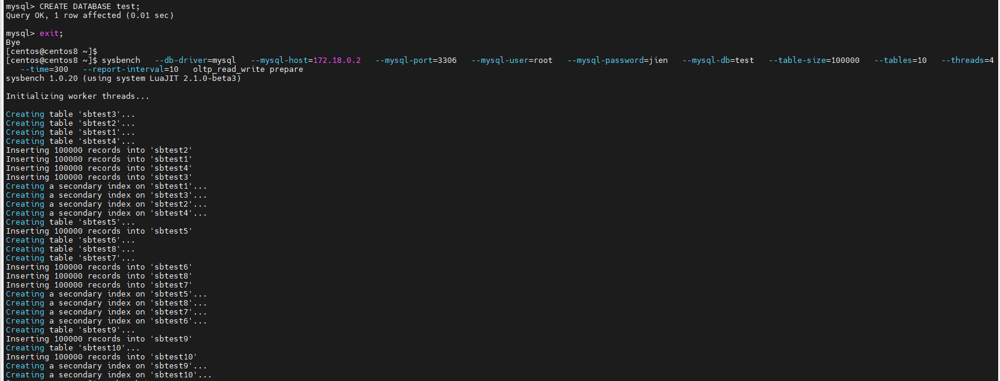
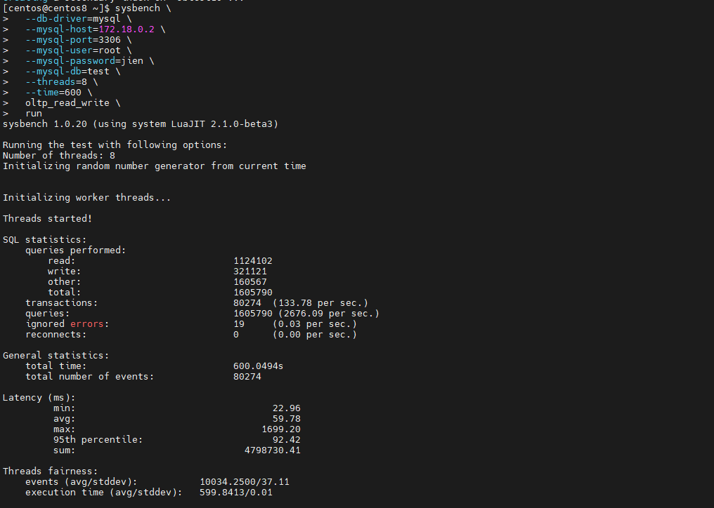
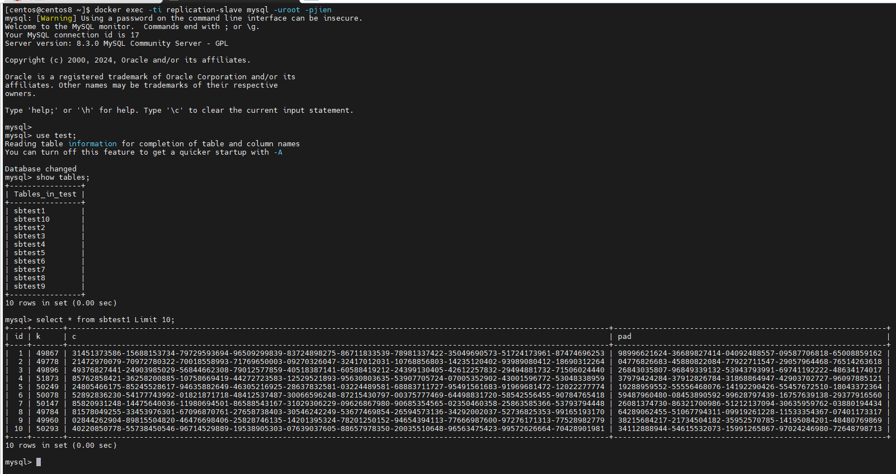

# Домашнее задание к занятию "`Репликация и масштабирование. Часть 1`" - `Одинаев Джиеншах`

### Инструкция по выполнению домашнего задания

1. Сделайте fork [репозитория c шаблоном решения](https://github.com/netology-code/sys-pattern-homework) к себе в Github и переименуйте его по названию или номеру занятия, например, https://github.com/имя-вашего-репозитория/gitlab-hw или https://github.com/имя-вашего-репозитория/8-03-hw).
2. Выполните клонирование этого репозитория к себе на ПК с помощью команды `git clone`.
3. Выполните домашнее задание и заполните у себя локально этот файл README.md:
   - впишите вверху название занятия и ваши фамилию и имя;
   - в каждом задании добавьте решение в требуемом виде: текст/код/скриншоты/ссылка;
   - для корректного добавления скриншотов воспользуйтесь инструкцией [«Как вставить скриншот в шаблон с решением»](https://github.com/netology-code/sys-pattern-homework/blob/main/screen-instruction.md);
   - при оформлении используйте возможности языка разметки md. Коротко об этом можно посмотреть в [инструкции по MarkDown](https://github.com/netology-code/sys-pattern-homework/blob/main/md-instruction.md).
4. После завершения работы над домашним заданием сделайте коммит (`git commit -m "comment"`) и отправьте его на Github (`git push origin`).
5. Для проверки домашнего задания преподавателем в личном кабинете прикрепите и отправьте ссылку на решение в виде md-файла в вашем Github.
6. Любые вопросы задавайте в чате учебной группы и/или в разделе «Вопросы по заданию» в личном кабинете.

Желаем успехов в выполнении домашнего задания.

---

### Задание 1

На лекции рассматривались режимы репликации master-slave, master-master, опишите их различия.

*Ответить в свободной форме.*

---

***Master-Slave***
В этом режиме только один сервер (master) обрабатывает все операции записи, а остальные (slaves) получают копии данных и обслуживают только чтение. Репликация происходит односторонне — от master к slave. Такой подход упрощает архитектуру, повышает производительность при чтении, но снижает отказоустойчивость: если master выходит из строя, нужно вручную переназначать нового.

***Master-Master***
Оба сервера работают как полноценные мастера: они могут принимать как чтение, так и запись. Репликация идет в обе стороны. Это повышает отказоустойчивость и позволяет распределить нагрузку на запись. Однако возможны конфликты, если данные одновременно изменяются на разных узлах — для их разрешения нужны дополнительные механизмы.

***Итог:***
Master-Slave — проще и надёжнее в плане согласованности, но менее гибкий.
Master-Master — более отказоустойчивый и масштабируемый, но требует сложной настройки.

### Задание 2

Выполните конфигурацию master-slave репликации, примером можно пользоваться из лекции.

*Приложите скриншоты конфигурации, выполнения работы: состояния и режимы работы серверов.*

---
Файл /etc/my.cnf на master

Файл /etc/my.cnf на slave

Статус мастера
;
Указваем реплике мастера и данные File и Position 

Статус slave

Смотрим Ip адрес мастера в docker network. Эту часть выполнил из любопытсва, в задании не указано

Настраиваем утилиту sysbensh для запуска тестовой нагрузки

Запускаем тестовую нагрузку

Смотрим сгененировнные данные на реплике

[Список команд](bash_commands.txt)

## Дополнительные задания (со звёздочкой*)
Эти задания дополнительные, то есть не обязательные к выполнению, и никак не повлияют на получение вами зачёта по этому домашнему заданию. Вы можете их выполнить, если хотите глубже шире разобраться в материале.

---

### Задание 3* 

Выполните конфигурацию master-master репликации. Произведите проверку.

*Приложите скриншоты конфигурации, выполнения работы: состояния и режимы работы серверов.*
