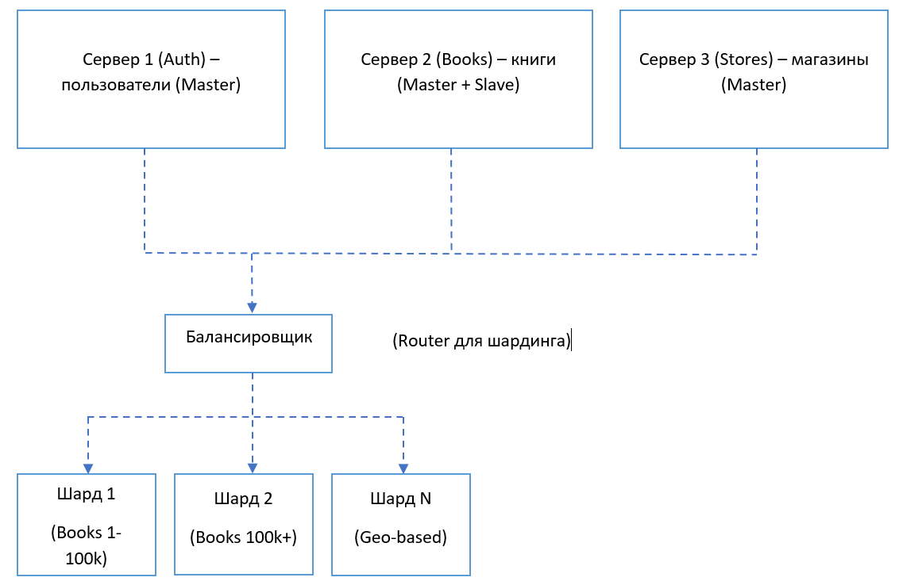

# Домашнее задание к занятию "`Репликация и масштабирование. Часть 2`" - `Одинаев Джиеншах`

### Инструкция по выполнению домашнего задания

1. Сделайте fork [репозитория c шаблоном решения](https://github.com/netology-code/sys-pattern-homework) к себе в Github и переименуйте его по названию или номеру занятия, например, https://github.com/имя-вашего-репозитория/gitlab-hw или https://github.com/имя-вашего-репозитория/8-03-hw).
2. Выполните клонирование этого репозитория к себе на ПК с помощью команды `git clone`.
3. Выполните домашнее задание и заполните у себя локально этот файл README.md:
   - впишите вверху название занятия и ваши фамилию и имя;
   - в каждом задании добавьте решение в требуемом виде: текст/код/скриншоты/ссылка;
   - для корректного добавления скриншотов воспользуйтесь инструкцией [«Как вставить скриншот в шаблон с решением»](https://github.com/netology-code/sys-pattern-homework/blob/main/screen-instruction.md);
   - при оформлении используйте возможности языка разметки md. Коротко об этом можно посмотреть в [инструкции по MarkDown](https://github.com/netology-code/sys-pattern-homework/blob/main/md-instruction.md).
4. После завершения работы над домашним заданием сделайте коммит (`git commit -m "comment"`) и отправьте его на Github (`git push origin`).
5. Для проверки домашнего задания преподавателем в личном кабинете прикрепите и отправьте ссылку на решение в виде md-файла в вашем Github.
6. Любые вопросы задавайте в чате учебной группы и/или в разделе «Вопросы по заданию» в личном кабинете.

Желаем успехов в выполнении домашнего задания.

---

### Задание 1

Опишите основные преимущества использования масштабирования методами:

- активный master-сервер и пассивный репликационный slave-сервер; 
- master-сервер и несколько slave-серверов;

*Дайте ответ в свободной форме.*

***Основные преимущества использования масштабирования методами:***

***1. Активный master-сервер и пассивный репликационный slave-сервер***
- ***Отказоустойчивость***: Если master выйдет из строя, slave может быть переведён в режим master (вручную или автоматически), минимизируя простои.
- ***Распределение нагрузки чтения***: Хотя запись идёт только на master, slave может обрабатывать запросы на чтение, снижая нагрузку на master.
- ***Резервное копирование***: Slave можно использовать для бэкапов без нагрузки на master.
- ***Тестирование и аналитика***: На slave можно запускать аналитические запросы и тесты, не влияя на рабочую БД.

***2. Master-сервер и несколько slave-серверов***
- ***Горизонтальное масштабирование чтения***: Запросы на чтение распределяются между несколькими slave, что значительно повышает производительность для read-heavy нагрузок.
- ***Геораспределение***: Slave-серверы можно размещать в разных регионах для уменьшения задержки у пользователей.
- ***Повышенная отказоустойчивость***: При выходе из строя одного slave остальные продолжают обслуживать запросы.
- ***Гибкость использования***: Разные slave могут использоваться для разных целей (аналитика, бэкапы, репликация в реальном времени).

***Итог***

Оба подхода улучшают отказоустойчивость и производительность, но использование нескольких slave-серверов даёт больше возможностей для масштабирования и распределения нагрузки.

---

### Задание 2

Разработайте план для выполнения горизонтального и вертикального шаринга базы данных. База данных состоит из трёх таблиц: 

- пользователи, 
- книги, 
- магазины (столбцы произвольно). 

Опишите принципы построения системы и их разграничение или разбивку между базами данных.

*Пришлите блоксхему, где и что будет располагаться. Опишите, в каких режимах будут работать сервера.* 

***План горизонтального и вертикального шардинга базы данных***
***1. Вертикальный шардинг***
***Принцип:*** Разделение таблиц по разным серверам в зависимости от их функциональной нагрузки.
***Сервер 1 (Users & Auth):***

- Таблица пользователи (user_id, login, password, email, role)
- Назначение: аутентификация и управление пользователями.
- Режим: Master (запись + чтение).

***Сервер 2 (Books & Content):***

- Таблица книги (book_id, title, author, price, stock)
- Назначение: хранение книг и управление инвентарём.
- Режим: Master (запись + чтение), можно добавить Slave для отчётов.

***Сервер 3 (Stores & Transactions):***

- Таблица магазины (store_id, location, manager_id, revenue)
- Назначение: управление магазинами и транзакциями.
- Режим: Master (запись + чтение).

***Преимущества:***

- Уменьшение нагрузки на один сервер.
- Лучшая изоляция данных (например, аутентификация отдельно от транзакций).

***2. Горизонтальный шардинг***
***Принцип:*** Разделение одной таблицы на несколько серверов по определённому ключу (например, по ID пользователя или региону).

***Пример для таблицы книги:***

- Шард 1: Книги с book_id от 1 до 100 000
- Шард 2: Книги с book_id от 100 001 до 200 000
- Шард N: ...

***Пример для таблицы магазины (геошардинг):***

- Шард "Север": Магазины из Москвы, Питера.
- Шард "Юг": Магазины из Ростова, Сочи.
- Шард "Запад": Магазины из Калининграда.

***Преимущества:***

- Распределение нагрузки на несколько серверов.
- Уменьшение задержки для географически распределённых пользователей.

***Блок-схема архитектуры***

***Режимы работы серверов***
***Master-серверы:***

- Принимают запросы на запись (INSERT, UPDATE, DELETE).
- Реплицируют данные на Slave (если есть).

***Slave-серверы:***

- Используются для чтения (SELECT).
- Могут быть промотированы в Master в случае отказа.

**Шарды:**

- Работают независимо, каждый обслуживает свою часть данных.
- Запросы распределяются через шард-роутер (например, по user_id или region).

***Вывод***

***Вертикальный шардинг*** помогает разделить нагрузку между разными типами данных.
***Горизонтальный шардинг ***позволяет масштабировать одну таблицу на несколько серверов.
***Master-Slave репликация*** добавляет отказоустойчивость и балансировку чтения.

Такой подход обеспечит высокую производительность и надёжность системы.

## Дополнительные задания (со звёздочкой*)
Эти задания дополнительные, то есть не обязательные к выполнению, и никак не повлияют на получение вами зачёта по этому домашнему заданию. Вы можете их выполнить, если хотите глубже шире разобраться в материале.

---
### Задание 3*

Выполните настройку выбранных методов шардинга из задания 2.

*Пришлите конфиг Docker и SQL скрипт с командами для базы данных*.
